# Managing via cdFMC — day-to-day workflow

!!! success "✅ REST API surface + license semantics captured 2026-07-11 · UI-side round-trip capture queued"
    All four load-bearing Ch 10 unknowns (auth model, endpoint paths, Configuration Status enum, strong-crypto license gate) verified against 2026-current Cisco DevNet + docs.defenseorchestrator.com sources. UI-side deploy walkthrough will be captured empirically against `fw1210ce` on the current live tenant.

**Prerequisites:** [Ch 9 — SCC onboarding](scc-onboarding.md) — device Online in cdFMC.

Day-to-day workflow once the FTD is cdFMC-managed. Endpoints, base URLs, and IDs match the reference-lab tenant `1210CE-Lab` where possible; adapt hostnames to yours.

## First look — cdFMC's Device Summary page

Once you land in cdFMC (see the "Getting into cdFMC" note below if you're not sure how), the direct-view of `fw1210ce` is at **Devices → *fw1210ce*** → **Device tab**. The Device Summary page is the single most useful diagnostic surface in cdFMC — one screen gives you the whole license posture, hardware ID, sync state, and health.

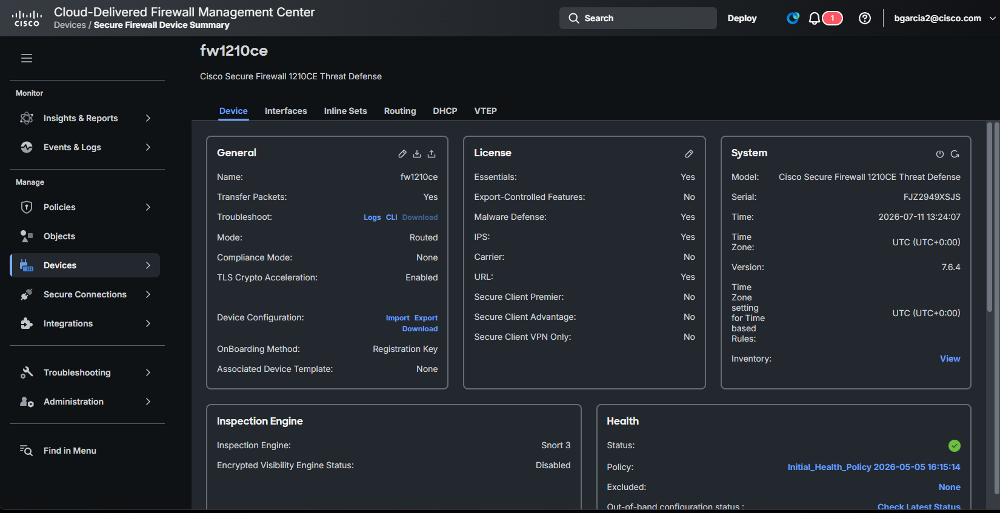
*Reference lab capture, 2026-07-11 — full device summary for `fw1210ce` after fresh Ch 9 onboard*

Empirical readout for the reference lab:

| Panel | Field | Value | What it means |
|---|---|---|---|
| Header | | Deploy button top-right | This is where Step 4's round-trip deploy fires |
| General | Name | `fw1210ce` | Matches Ch 9 Step 2a input |
| General | Mode | `Routed` | Matches Ch 6 baseline |
| General | TLS Crypto Acceleration | `Enabled` | Hardware-level (1210CE hardware includes crypto acceleration), independent of software Smart License strong-crypto |
| General | OnBoarding Method | `Registration Key` | Matches Ch 9 method |
| **License** | **Essentials** | Yes | Base tier is entitled |
| **License** | **Export-Controlled Features** | **No** ⚠ | cdFMC-side strong-crypto gate is **CLOSED**. Ch 10 Step 6 predicts strong-crypto deploys will fail with the manager-side `"Strong crypto (i.e encryption algorithm greater than DES) for VPN topology ... is not supported"` error |
| License | Malware Defense / IPS / URL | Yes | Ch 9 Step 2c license entitlements are honored by cdFMC |
| License | Secure Client Premier/Advantage/VPN Only | No | RA-VPN blocked at manager level |
| System | Model | Cisco Secure Firewall 1210CE Threat Defense | |
| System | Serial | `FJZ2949XSJS` | Cross-reference with SCC inventory API `metadata.serialNumber` |
| System | Version | `7.6.4` | Matches FTD self-report — sftunnel exchanging accurate telemetry |
| System | Time | 2026-07-11 13:24:07 UTC | cdFMC defaults to UTC; note the offset in event correlation |
| Inspection Engine | Snort 3 | | Ch 8 default; Snort 2 is legacy |
| Inspection Engine | Encrypted Visibility Engine | Disabled | Off by default; enable later if TLS visibility needed |
| Health | Status | 🟢 (green) | Initial_Health_Policy is applied |

!!! success "Empirical validation of Ch 10 Step 6"
    The License panel's `Export-Controlled Features: No` is exactly the state Ch 10 Step 6 predicts will trigger the manager-side strong-crypto block. This is not an accident of the reference lab — it is the default for a cdFMC tenant that has never registered with Smart Software Manager (CSSM). Every fresh Base-tier cdFMC starts here.

    **The 90-day evaluation countdown starts at cdFMC provisioning time** — see [Cloud-Delivered FMC and Threat Defense licenses](https://docs.defenseorchestrator.com/cdfmc/cloud-delivered-firewall-management-center-and-threat-defense-licenses.html). After it expires, *all* deploys are blocked, not just strong-crypto ones. Register with CSSM (Ch 14, queued) before the 90-day clock runs out on the reference tenant.

### Getting into cdFMC (from SCC) — the empirically-verified path

**Verified 2026-07-11 on the reference lab:** click the `fw1210ce` row in SCC → **Security Devices**. A right-side drawer opens with grouped shortcuts. Under **Device Management → Device Overview**, click. cdFMC opens in a new browser tab, pre-scoped to `fw1210ce`.

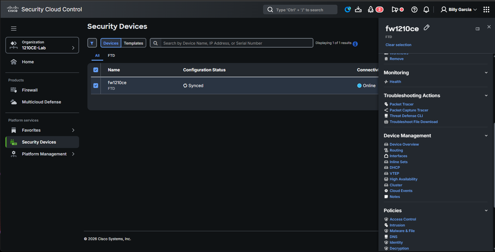
*The right drawer that opens when you select a device row in SCC. Note the four grouped sections + the closed All-tab discrepancy (Configuration Status now reads `Synced` — the ~10-min propagation lag has resolved)*

The drawer's full shortcut inventory (each link opens the corresponding cdFMC page pre-scoped to this device):

| Group | Shortcut | Opens in cdFMC |
|---|---|---|
| Monitoring | Health | Device health monitoring page |
| Troubleshooting Actions | Packet Tracer | Packet trace tool for this device |
| Troubleshooting Actions | Packet Capture Tracer | Live packet capture with trace |
| Troubleshooting Actions | Threat Defense CLI | Web-based FTD CLI session |
| Troubleshooting Actions | Troubleshoot File Download | Diagnostic bundle generator |
| **Device Management** | **Device Overview** | **The device summary page** (this is the entry we use) |
| Device Management | Routing | Routing config editor |
| Device Management | Interfaces | Interface config editor |
| Device Management | Inline Sets | Inline-pair config |
| Device Management | DHCP | DHCP scope editor |
| Device Management | VTEP | VXLAN tunnel endpoint config |
| Device Management | High Availability | HA pair setup |
| Device Management | Cluster | Cluster membership |
| Device Management | Cloud Events | Event stream to cdFMC |
| Device Management | Notes | Free-form device notes |
| Policies | Access Control | ACP editor |
| Policies | Intrusion | IPS policy editor |
| Policies | Malware & File | Malware & file policy editor |
| Policies | DNS | DNS policy editor |
| Policies | Identity | Identity policy editor |
| Policies | Decryption | TLS decryption policy |

**Practical rule:** SCC's Security Devices page + this drawer is the "hub" for device-scoped navigation. You rarely need to navigate cdFMC's own left-nav Devices menu manually.

**Two other paths that also work** (kept for reference but the drawer path above is what to use):

- **Via SCC left nav → Integrations → Firewall Management Center → cdFMC instance** — lands on cdFMC's home page instead of the device summary. [unverified against reference lab; deduced from Cisco doc conventions]
- **Via direct URL** — `https://1210ce-lab--ti0cqk.app.us.cdo.cisco.com/` in a browser tab where SCC SSO is already active. Same result. [unverified — landing behavior may depend on session cookie state]

The `Deploy` button in the top-right cdFMC header is the destination for Step 4's round-trip.

### cdFMC auto-deploys the initial policy assignment — retroactively surfaced by the notifications pane

**Empirical finding from the reference lab, 2026-07-11:** cdFMC fires an automatic deploy of the assigned Default Access Control Policy as part of the onboarding sequence. You do not have to click Deploy to trigger it — it happens once the FTD comes Online and the ACP association takes effect.

Click the 🔔 bell icon in the top-right header → **Deployments** tab to see the deploy history. Reference-lab capture:

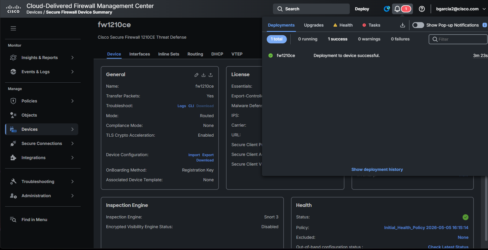
*Notifications pane at 09:27 EDT — shows `fw1210ce · Deployment to device successful · 3m 23s`. The "3m 23s" is deploy DURATION, not "time ago" — clarified by the Deployment History page below.*

For the authoritative record, follow **Deploy → Deployment History** in cdFMC's top nav (or click `Show deployment history` in the notifications popover):

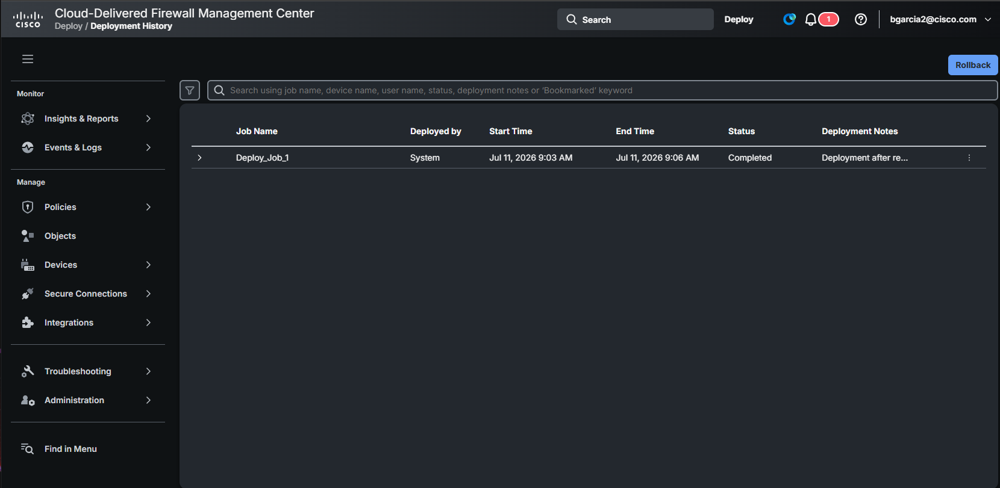
*Deployment History for the reference lab. One row: `Deploy_Job_1` by `System`, Start 9:03 AM → End 9:06 AM EDT, Status Completed, Notes "Deployment after re..." (truncated).*

Reference-lab timing table:

| Time (EDT) | Event | Where captured |
|---|---|---|
| 08:57 | `configure manager add` fired on FTD | FTD SSH log |
| 09:01 | sftunnel Registration Completed | FTD `show managers` poll |
| 09:03 | cdFMC auto-deploy `Deploy_Job_1` Started | cdFMC Deployment History |
| 09:06 | cdFMC auto-deploy Completed (~3-min duration) | cdFMC Deployment History |
| 09:12 | SCC All tab still showed `Not Synced` | Ch 9 screenshot |
| 09:29 | SCC All tab caught up to `Synced` | Ch 10 device-drawer screenshot |

**End-to-end onboarding wall clock is ~9 minutes** from `configure manager add` to policy live on device. The remaining ~23 min in the SCC lag window is documented Cisco propagation behavior (Ch 10 Step 5's "up to 10 minutes" observed at ~23 min on the reference lab).

### The full task chain — from cdFMC Task Manager

The Deployment History page shows only deployment jobs. The **Task Manager** (bell icon → Tasks tab → download button) shows the complete task history, including the internal cdFMC tasks that fire during onboarding. Reference-lab CSV export (captured `2026-07-11 09:33:57 EDT`, [saved to captures/](../captures/ch9-ch10-task-manager-report-2026-07-11.csv)):

| Category | Task body | Started | Finished | Status |
|---|---|---|---|---|
| Register | Registration fw1210ce: **Registration timed out. Please check connectivity and registration id** | 08:55:25 | 08:57:31 | ⚠ FAILURE (first attempt — interrupted SSH) |
| Register | Registration fw1210ce: Started device discovery | 08:58:03 | 09:01:20 | ✅ SUCCESS |
| SFTunnel | fw1210ce - SFTunnel connection established successfully | 09:02:46 | 09:02:46 | ✅ SUCCESS (marker) |
| Discovery | fw1210ce - Discovery from the device is successful | 09:01:19 | 09:03:28 | ✅ SUCCESS |
| Health Policy | Apply Initial_Health_Policy 2026-05-05 16:15:14 to fw1210ce Health Policy applied successfully | 09:03:28 | 09:04:42 | ✅ SUCCESS |
| Deployments | fw1210ce - Deployment to device successful | 09:03:27 | 09:06:50 | ✅ SUCCESS (Deploy_Job_1) |

**Full sequence: Register → Discovery → SFTunnel → Health Policy Apply → Deploy.** All four internal tasks + the auto-deploy fired without user intervention.

The `SFTunnel` task has `0s` duration — it is a **marker event** logged the instant sftunnel comes up, not a task with a work interval.

**Rule for the guide reader:** the Task Manager CSV export is the authoritative deployment forensics record. When something goes wrong, download this CSV first — timestamps + task-body strings are what Cisco TAC will ask for.

### The cdFMC-side Health warning (⚠) — what it is

The Health tab in the notifications popover shows a yellow ⚠ warning. The CSV row for it:

```
Health   1210ce-lab--ti0cqk   Devices   Process Status   hmdaemon exited 5 time(s).   WARNING
```

- **Device: `1210ce-lab--ti0cqk`** (the cdFMC management appliance itself, not `fw1210ce`)
- **Category: Process Status**
- **Process: `hmdaemon`** — Health Monitor daemon on cdFMC's own management plane
- **Symptom: exited 5 times**

**This is NOT a `fw1210ce` health issue.** It is cdFMC's own internal service having restarted 5 times. Typically benign transient (the daemon auto-recovers), but worth noting in the guide as "expected chatter on a fresh cdFMC instance." If the count keeps climbing over days, escalate to TAC.

### CRITICAL: the deployed Default ACP blocks all through-traffic by default

Right after `Deploy_Job_1` completed, the `Default Access Control Policy` is live on `fw1210ce` — and it is an empty policy with `Default Action: Access Control: Block All Traffic`. **The FTD is currently blocking all through-traffic.** This is Cisco's safe onboarding default, not a bug.

Reference-lab capture — Policy Editor for `Default Access Control Policy` (path: `Policies / Security policies / Policy Editor`):

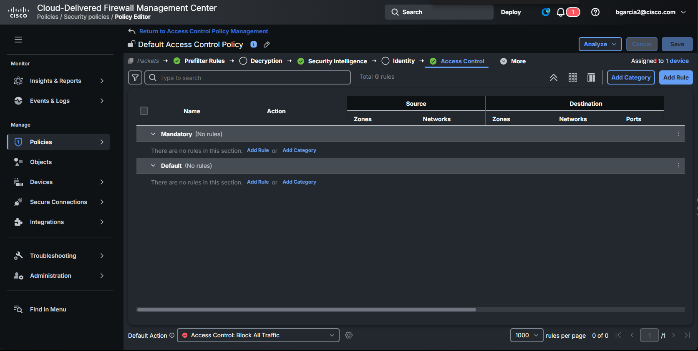
*Empty ACP: 0 rules, both `Mandatory` and `Default` sections show `(No rules)`, and the `Default Action` at the bottom reads `Access Control: Block All Traffic`. Top-right confirms `Assigned to 1 device`.*

**What the reader needs to understand:**

- **This is why nothing passes through the firewall post-onboard.** Ping through, HTTP through, DNS through — all dropped.
- **`Mandatory` vs `Default` are structural sections**, not rule states. Rules in Mandatory run before rules in Default. Both are empty here.
- **The traffic-processing pipeline tabs at the top** (Prefilter Rules, Decryption, Security Intelligence, Identity, Access Control, More) show green checkmarks for the three configured stages: Prefilter, Security Intelligence, Access Control. Decryption and Identity are unconfigured (empty circles).
- **To make traffic flow**, you need to author at least one Access Control rule with an Allow action, or change the Default Action away from `Block All Traffic`. Both require another Deploy to take effect on the device.

**Guide-writing implication:** every reader following Ch 9 → Ch 10 lands here with a blocking firewall. Ch 10's next-real-work section (currently Step 7 placeholder) needs a "Write your first Allow rule" walkthrough or the guide leaves the reader with a functionally dead box.

### 1210CE-specific gotcha: out-of-band change detection is NOT supported

If you click the `Check Latest Status` link next to `Out-of-band configuration status:` on the Device Summary page's Health panel, the 1210CE surfaces this modal:

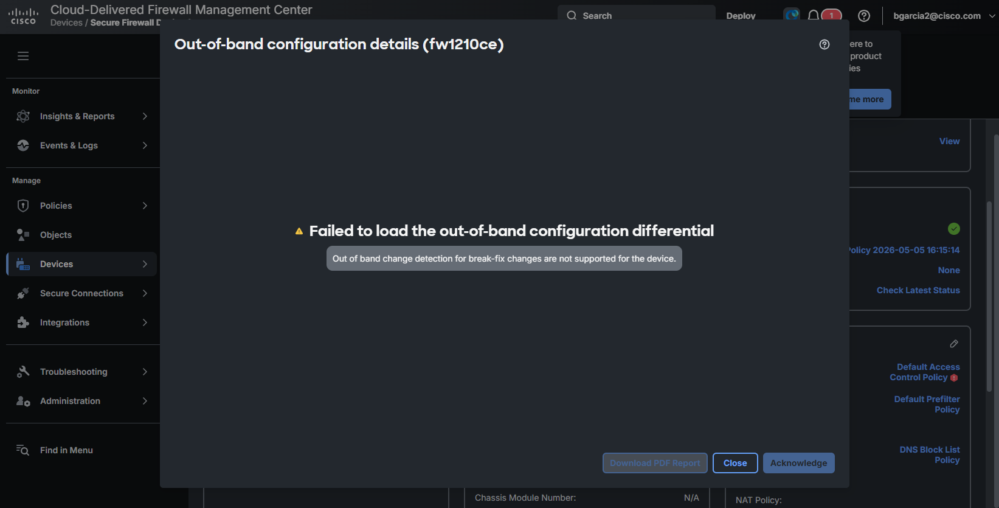
*Modal title `Out-of-band configuration details (fw1210ce)` · error text: "Failed to load the out-of-band configuration differential" · explanation: "Out of band change detection for break-fix changes are not supported for the device."*

**What this means:** cdFMC cannot detect config changes made outside of cdFMC (e.g., someone SSHs into the FTD as admin and runs `configure` commands directly). Other FTD hardware families (larger 3100/4200 series and virtual FTDs) support this detection; the 1210CE apparently does not, at least in FTD 7.6.4-69.

**Practical rule for the guide:** on cdFMC-managed 1210CEs, treat direct SSH-to-FTD as a compliance and drift risk. If a break-fix requires direct CLI action:

1. Document it before touching the FTD
2. Immediately after, deploy an empty change from cdFMC (edit device description, deploy) to re-synchronize cdFMC's expected config with the on-device reality
3. Verify `configState=SYNCED` via API before considering the box back to steady state

### cdFMC ships Talos content updates automatically to managed FTDs

The CSV shows cdFMC ran its own Talos content pulls BEFORE our device was onboarded — earlier in the same morning:

```
08:14:01 - 08:18:00  GeoDB-2026-06-20-081                (3m 59s)  cdFMC self-install
08:28:19 - 08:33:43  VDB-433 Cisco Vulnerability DB      (5m 24s)  cdFMC self-install
08:38:25 - 08:40:43  lsp rel 20260708 1827 (LSP)         (2m 18s)  cdFMC self-install
08:40:50 - 08:42:38  Snort Rule Update 2026 07 08 001    (1m 48s)  cdFMC self-install
```

Then at 09:03-09:06 when the auto-deploy fired, cdFMC pushed **all four content packages** down to `fw1210ce` as part of the deployment.

**Consequence for [Ch 8 — Talos content updates](content-updates.md):**

The per-device FDM API flow that Ch 8 documented (`POST /action/deploysrundata`, `POST /action/deploygeolocationdata`, etc.) is **superseded** for cdFMC-managed FTDs. cdFMC handles Talos content sync automatically as part of every deploy. The Ch 8 flow remains valid for FDM-standalone deployments; add a Ch 8 note that it does not apply to cdFMC-managed FTDs.

**Key `Deployed by` field values you'll see over time:**

| Value | Meaning |
|---|---|
| `System` | cdFMC-triggered automatic deploy (onboarding, license reconciliation, scheduled updates) |
| `<username>` | User-initiated deploy from cdFMC UI |
| `API` (or similar) | REST-API-triggered deploy via `POST deploymentrequests` [unverified — string not empirically confirmed on reference lab] |

**Why this matters for the discrepancy in [Ch 9 Step 3b](scc-onboarding.md#3b-1-the-all-tab-and-the-ftd-tab-disagree-and-why):**

The SCC All-tab `Not Synced` we saw at 09:12 was the pre-auto-deploy state. By the time we entered cdFMC at 09:27, the auto-deploy had already succeeded (~09:24), so the cdFMC-direct FTD-tab view showed `Synced`. The SCC All-tab hadn't caught up yet — Cisco's documented 10-min propagation lag. **The tabs weren't lying — they were just seeing different points in time.**

**Consequence for Step 4:** the "round-trip test" is no longer "prove the pipe by doing the first deploy" — that deploy already happened. Instead, the round-trip is now "prove the pipe by doing an *incremental* deploy" — make a policy change in cdFMC, deploy, watch the new job appear in the Deployments tab and complete.

## Auth model

cdFMC uses **Bearer token authentication**. Every API call carries:

```
Authorization: Bearer <TOKEN>
Content-Type: application/json
```

The token is a JWT issued by Security Cloud Control (SCC). Payload claims include `Roles`, `parentId` (tenant), and `clusterId`. For API-Only-User and My-Tokens tokens, the `exp` claim is absent — these are **long-lived, non-expiring credentials**. Rotation is manual: refresh (issues a new token, invalidates the old one) or revoke.

The **same SCC-issued token** authenticates both the SCC platform API and the cdFMC REST API — one credential, not two.

What cdFMC auth explicitly is **not**:

- Not on-prem FMC's `X-auth-access-token` / `X-auth-refresh-token` pair (30-min TTL, 3 refreshes, 90-min max). That pattern is on-prem FMC 6.1+ only; it will not authenticate against cdFMC.
- Not OAuth 2.0 client-credentials. There is no `/oauth2/token` grant, no `client_id` / `client_secret` exchange documented for the API path.

Sources: [DevNet — cdFMC Getting Started](https://developer.cisco.com/docs/cisco-security-cloud-control-firewall-manager/getting-started/), [DevNet — SCC Authentication](https://developer.cisco.com/docs/cisco-security-cloud-control/authentication/), [docs.defenseorchestrator.com — Renew an API Token](https://docs.defenseorchestrator.com/cdfmc/t-renewan-api-token.html).

## Base URL — pick one pattern and stick with it

### Pattern A — direct cdFMC tenant hostname

```
https://1210ce-lab--ti0cqk.app.us.cdo.cisco.com/api/fmc_config/v1/domain/{DOMAIN_UUID}/
https://1210ce-lab--ti0cqk.app.us.cdo.cisco.com/api/fmc_platform/v1/…
```

Port 443 implicit. This is the hostname your tenant DNS resolves to.

### Pattern B — SCC regional API gateway (recommended for new automation)

```
https://api.us.security.cisco.com/firewall/v1/cdfmc/api/fmc_config/v1/domain/{DOMAIN_UUID}/
```

Verified DevNet example:

```bash
curl -X GET \
  --url https://api.us.security.cisco.com/firewall/v1/cdfmc/api/fmc_config/v1/domain/{domainUid}/policy/accesspolicies \
  --header "Authorization: Bearer $API_TOKEN"
```

Regional gateways (SCC public-API region, not AWS region):

| Region  | Base URL                                    |
|---------|---------------------------------------------|
| US      | `https://api.us.security.cisco.com/firewall`   |
| EU      | `https://api.eu.security.cisco.com/firewall`   |
| APJ     | `https://api.apj.security.cisco.com/firewall`  |
| AUS     | `https://api.au.security.cisco.com/firewall`   |
| India   | `https://api.in.security.cisco.com/firewall`   |
| UAE     | `https://api.uae.security.cisco.com/firewall`  |
| FedRAMP | `https://manage.secure.cisco/api/rest`         |

The `us` in `api.us.security.cisco.com` is the SCC public-API region, not the underlying AWS region. This tenant sits in AWS `us-west-2` behind the `us` SCC region → use `api.us.security.cisco.com`. [unverified — Cisco doc formally mapping AWS region → SCC region not located; inferred from the tenant hostname living under `app.us.cdo.cisco.com`.]

The `<slug>--<hash>.app.us.cdo.cisco.com` hostname grammar (this tenant: `1210ce-lab--ti0cqk`) is a stable observation, not a documented spec. [unverified — Cisco doc source not located.]

## Step 1 — Mint the API token

!!! danger "BLOCKED on 2026-07-11 — Base-tier Firewall Manager API token minting has no working UI path on this tenant"
    Empirical dead-end reached during the reference-lab walkthrough. Every UI path documented by Cisco for minting a Firewall-Manager-scoped API token either doesn't exist in the 2026 SCC UI, or exists but doesn't offer the necessary product scope. TAC case opened; the outcome will determine whether this section documents a working flow or a Base-tier limitation.

    See below for the exhaustive check + the TAC case draft in [captures/ch10-tac-case-draft-2026-07-11.md](../captures/ch10-tac-case-draft-2026-07-11.md).

### Two token surfaces exist — only one is Firewall-Manager-scoped

Per Cisco DevNet docs research, SCC has two separate token-minting surfaces:

| Surface | Menu path | Product scope offered | Authorizes |
|---|---|---|---|
| **SCC Platform API** | `Platform Management → API Keys` | Only `Security Cloud Control` | `/orgs`, `/subscriptions`, `/users`, `/admin-groups` — SCC platform metadata |
| **SCC Firewall Manager API** | (Cisco docs say `Administration → API User Management`, but this menu is NOT present in Base-tier 1210CE-Lab UI) | Should offer `Firewall Management` roles like `Super Admin`, `Admin`, `Edit-Only`, `Read-Only`, `Deploy-Only`, `VPN Sessions Manager` | Everything under `/firewall/*` including the `/cdfmc/api/fmc_config` proxy path — the actual cdFMC REST surface |

The reference-lab walkthrough attempted to mint a token from the first surface and used it against Firewall Manager endpoints — every request returned HTTP 400 (not 401) at the SCC gateway. The gateway recognizes the token but refuses to route it to the Firewall Manager backend because the token has no Firewall Manager scope.

### Reference-lab attempt — Platform Management → API Keys

For anyone reproducing our steps:

1. In SCC left nav, click `Platform Management` → `API Keys`.

    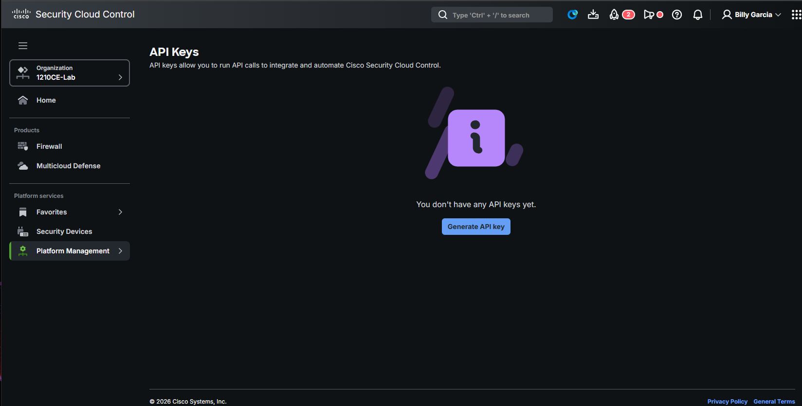
    *Empty state before minting the first key.*

2. Click `Generate API key`. A right-side panel opens.

    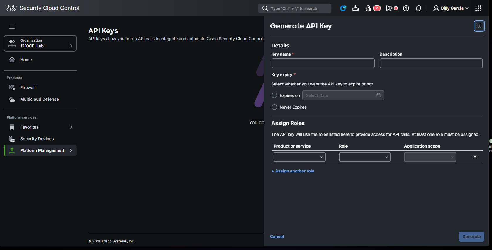
    *Key name, Description, Key expiry, and Assign Roles section.*

3. Fill in Details: `Key name = fw1210ce-guide-api`, description, `Never Expires`.
4. In `Assign Roles`, the `Product or service` dropdown ONLY offers `Security Cloud Control`. There is no `Firewall Management` option to select.

    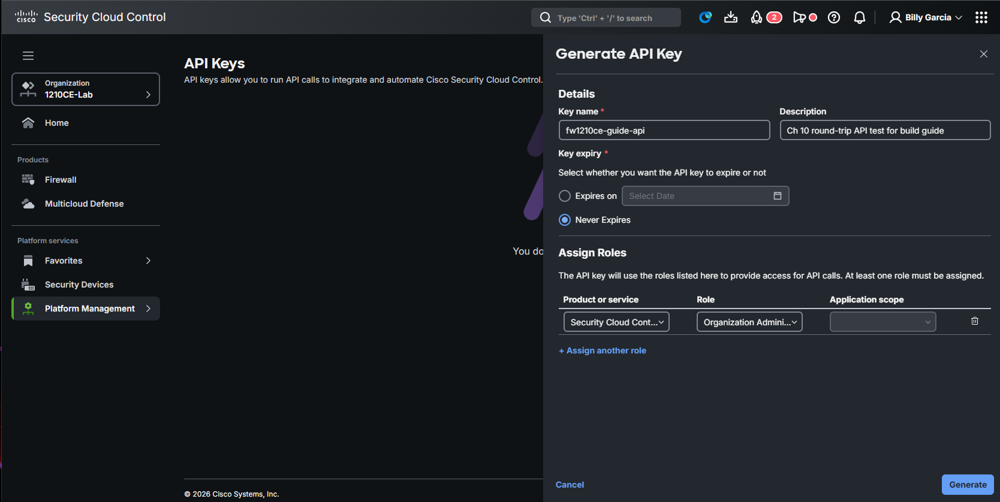
    *`Security Cloud Control` selected as Product, `Organization Administrator` as Role. `Application scope` is disabled (org-level roles are automatically scoped).*

5. Click `Generate`. The token is displayed with its Access Token (JWT) and Refresh Token. Save immediately — displayed once.

    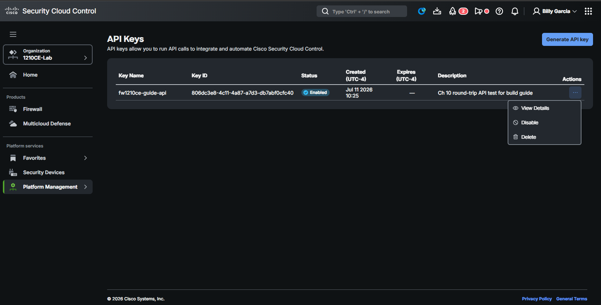
    *The generated key appears in the list with `Status: Enabled`, its Key ID (matches the JWT's `cis_uuid` claim), and a three-dot menu offering `View Details / Disable / Delete`.*

### Empirical exhaustive check — the Firewall-Manager-scope UI does not exist on this tenant

**Path 1: `Platform Management → Administrator Access → + Invite`** — this opens a wizard to invite HUMAN users only, with fields for First Name / Last Name / Email. No `API Only User` checkbox in any of its three steps (User details / Add to groups / Assign roles):

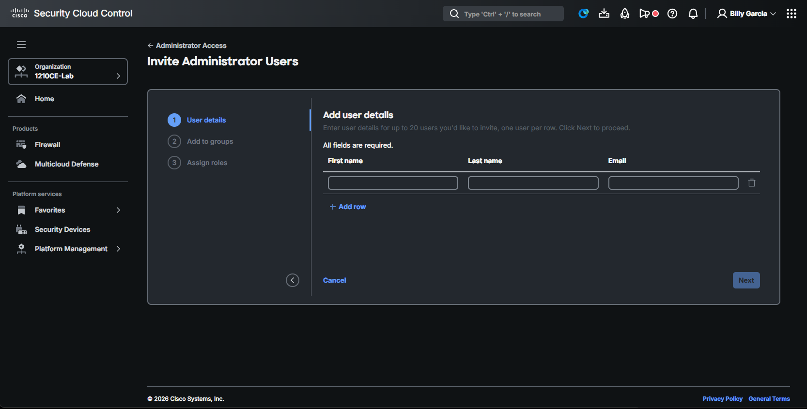
*Only human-user fields. No API-only checkbox.*

**Path 2: `Platform Management → Administrator Access → Admin groups → All Products Administrator → Add users`** — same human-user invite flow. The group itself carries `Firewall Management: Super Administrator` and `Multicloud Defense: Administrator`, but users added to it are humans, not machine credentials:

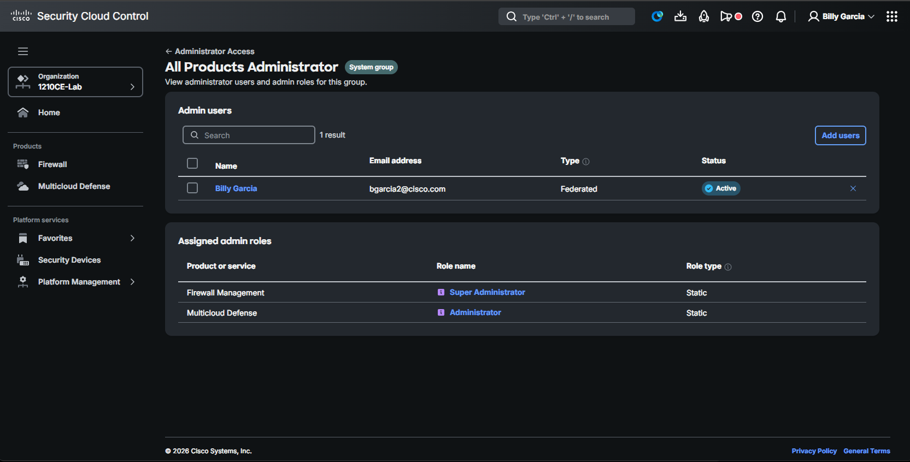

**Path 3: `Platform Management → Administrator Access → Admin roles`** — this is a catalog of roles per product, viewable/filterable but not a token-creation UI:

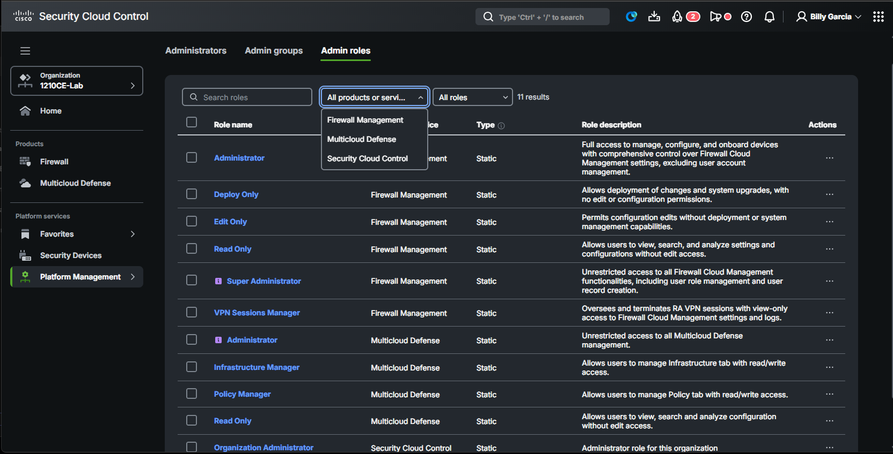
*Roles per product visible: Firewall Management, Multicloud Defense, Security Cloud Control. Cannot create API-only user from this tab.*

**Path 4: cdFMC → username dropdown → `User Preferences`** — Cisco DevNet's older docs describe this as the API token generation path. In the 2026 cdFMC UI on this tenant, it only offers Time Zone. No `My Tokens`, no `Generate API Token`.

### JWT payload of the SCC Platform token — for reference

The token minted from `Platform Management → API Keys` is a signed JWT with these public claims (decoded from base64url, sensitive `private` field omitted):

```json
{
  "iss": "https://idbroker-b-us.webex.com/idb",
  "token_type": "Bearer",
  "user_type": "machine",
  "machine_type": "bot",
  "cluster": "P0A1",
  "org_id": "<tenant-org-UUID>",
  "cis_uuid": "<matches the SCC API Key ID>",
  "expiry_time": 1783844752511,
  "exp": 1783844752511
}
```

**Notes:**

- Issuer is `idbroker-b-us.webex.com/idb` — Cisco's Webex Common Identity broker, the unified auth backend across Cisco products.
- `cis_uuid` claim matches the Key ID column shown in SCC's API Keys list. Useful when correlating a token to its origin.
- `expiry_time` and `exp` are both present even though the SCC UI radio button was set to `Never Expires`. The token does have an exp claim — the "Never Expires" label appears to mean "no exp set at creation time" in SCC's model, but the actual JWT is issued with an exp based on the identity broker's defaults. **This is a discrepancy worth flagging** — long-term automation shouldn't assume Never-Expires tokens actually never expire.

### TAC case opened

The reference-lab tenant has a case open with Cisco TAC asking:

1. Is Firewall Manager API access included in Base tier?
2. If not, what tier / add-on unlocks it?
3. Are the docs describing `Administration → API User Management` still authoritative for 2026 tenants, or has that page moved?

Full draft at [captures/ch10-tac-case-draft-2026-07-11.md](../captures/ch10-tac-case-draft-2026-07-11.md).

This section will be replaced with the working token-mint flow (or the confirmed tier requirement) once TAC responds.

### If your tenant DOES have the path — how to use the resulting token

If your tenant surfaces the `API User Management` (or equivalent) page and you can mint a Firewall-Manager-scoped token, the URLs Cisco documents are:

```bash
# Regional gateways (SCC public-API region, not AWS region):
# US:  https://api.us.security.cisco.com/firewall
# EU:  https://api.eu.security.cisco.com/firewall
# APJ: https://api.apj.security.cisco.com/firewall
# AU:  https://api.au.security.cisco.com/firewall

# All calls carry:
#   Authorization: Bearer <TOKEN>
#   Accept: application/json

# Verify token:
curl --url https://api.us.security.cisco.com/firewall/v1/token \
     --header "Authorization: Bearer $API_TOKEN" \
     --header "Accept: application/json"

# List cdFMC managers (returns fmcDomainUid needed for FMC config calls):
curl --url 'https://api.us.security.cisco.com/firewall/v1/inventory/managers?q=deviceType:CDFMC' \
     --header "Authorization: Bearer $API_TOKEN" \
     --header "Accept: application/json"
```

See [Step 4 — Round-trip deploy](#step-4-round-trip-deploy) for the full endpoint sequence.

## Step 1B — WHY the SCC Platform token doesn't reach cdFMC

The SCC gateway rewrites `/firewall/*` paths to an internal `/api/rest/*` path (visible in every 400 response body's `path` field). It does this via a component named `scc-gateway` in the URL trace. When the gateway checks the token's product scope against the requested backend service, tokens minted with only `Security Cloud Control` scope fail the check for the Firewall Manager backend — resulting in HTTP 400 rather than 401 or 403.

This is architecturally sensible (least-privilege enforcement at the API gateway) but the 400-versus-403 error code choice makes debugging harder — a 403 would immediately telegraph "wrong scope" while 400 sends readers hunting for URL typos.

### Verify the token — first API call

Health-check the credential before anything else touches it:

```bash
curl -X GET \
  --url https://api.us.security.cisco.com/firewall/v1/token \
  --header "Authorization: Bearer $API_TOKEN"
```

`200` returns tenant name and UID, enterpriseId, product-instance id, roles array, and (only if the token was provisioned with one) an RFC-3339 expiration timestamp. `401` = invalid or expired.

Source: [DevNet — Get Token Info](https://developer.cisco.com/docs/cisco-security-cloud-control-firewall-manager/get-token-info/).

!!! danger "Store the token in OpenBao — never inline in the guide"
    Per this workspace's [OpenBao credential rule](../CLAUDE.md), any cdFMC API token is a Tier-3 credential. Store at `infra/api/cdfmc-<tenant-name>` and read at use time with `bao kv get -field=token`. Never paste a real token into commits, screenshots, or Slack.

## Step 2 — Discover the domain UUID

cdFMC is multi-tenant internally via "domains". Every `/api/fmc_config/v1/…` call requires a domain UUID in its path. Base-tier tenants have exactly one domain: **Global**. Discover it — do not hardcode.

The example UUID `e276abec-e0f2-11e3-8169-6d9ed49b625f` that appears throughout Cisco docs is a documentation placeholder. It is not your UUID.

### Option 1 — platform info endpoint

Against the tenant hostname:

```bash
curl -X GET \
  --url https://1210ce-lab--ti0cqk.app.us.cdo.cisco.com/api/fmc_platform/v1/info/domain \
  --header "Authorization: Bearer $API_TOKEN"
```

Or against the SCC gateway:

```bash
curl -X GET \
  --url https://api.us.security.cisco.com/firewall/v1/cdfmc/api/fmc_platform/v1/info/domain \
  --header "Authorization: Bearer $API_TOKEN"
```

Response is a paged list; for a single-domain tenant, the Global UUID is at `items[0].uuid`:

```bash
DOMAIN_UUID=$(curl -sS \
  --url https://1210ce-lab--ti0cqk.app.us.cdo.cisco.com/api/fmc_platform/v1/info/domain \
  --header "Authorization: Bearer $API_TOKEN" \
  | jq -r '.items[0].uuid')
```

Source: [Cisco Learning — FMC REST Token Authentication codelab](https://ciscolearning.github.io/cisco-learning-codelabs/posts/fmc-rest-token-authentication/).

### Option 2 — SCC inventory endpoint

```bash
curl -X GET \
  --url 'https://api.us.security.cisco.com/firewall/v1/inventory/managers?q=deviceType:CDFMC' \
  --header "Authorization: Bearer $API_TOKEN"
```

Response includes the `fmcDomainUid` field for this tenant.

Source: [DevNet — cdFMC Getting Started](https://developer.cisco.com/docs/cisco-security-cloud-control-firewall-manager/getting-started/).

## Step 3 — List and inspect devices

All classic FMC paths share the prefix `/api/fmc_config/v1/domain/{domainUUID}/...`. cdFMC prepends a routing prefix but the suffix is byte-identical to on-prem.

### List devices

```
GET /api/fmc_config/v1/domain/{domainUUID}/devices/devicerecords
```

Query params ([getAllDevice](https://developer.cisco.com/docs/fmc-ansible/getalldevice/)):

- `offset` (int) — starting index
- `limit` (int) — max items
- `expanded` (bool) — return full Device objects instead of summary + link
- `filter` (string) — filter by name/hostname/serial/containerType/version

Response envelope is the standard FMC list shape:

```json
{
  "links": {"self": "..."},
  "paging": {"offset": 0, "limit": 25, "count": 1, "pages": 1},
  "items": [
    {"id": "<uuid>", "name": "fw1210ce", "type": "Device",
     "links": {"self": ".../devicerecords/<uuid>"}}
  ]
}
```

### Get one device

```
GET /api/fmc_config/v1/domain/{domainUUID}/devices/devicerecords/{objectId}
```

Verified response fields ([Get Device — SCC Firewall Manager](https://developer.cisco.com/docs/cisco-security-cloud-control-firewall-manager/devices-get-device/)):

```json
{
  "id": "11223344-46dd-11f0-a165-001122334455",
  "name": "fw1210ce",
  "hostName": "192.168.40.10",
  "type": "Device",
  "model": "Cisco Secure Firewall 1210CE Threat Defense",
  "sw_version": "7.6.4",
  "isConnected": true,
  "deploymentStatus": "DEPLOYED",
  "healthStatus": "green",
  "accessPolicy": {"id": "...", "type": "AccessPolicy", "name": "Default Access Control Policy"},
  "license_caps": ["BASE", "THREAT"],
  "metadata": {"serialNumber": "...", "cpu": "...", "memory": "..."},
  "snortEngine": "SNORT3",
  "ftdMode": "ROUTED"
}
```

`ftdMode` verified values include `ROUTED` and `TRANSPARENT`.

`description` field on the Device model: [unverified — Cisco doc source not located] as a top-level Device field. If your round-trip test depends on modifying a description string, GET a real device against your cdFMC and inspect the returned body first.

### Update a device (read-modify-write)

```
PUT /api/fmc_config/v1/domain/{domainUUID}/devices/devicerecords/{objectId}
```

Cisco documents this via the `updateDevice` operation ([updateDevice](https://developer.cisco.com/docs/fmc-ansible/updatedevice/)). Example params listed on the DevNet page: `id`, `name`, `type=Device`, `hostName`, `license_caps`, `performanceTier`, `prohibitPacketTransfer`.

PATCH support and full-replace semantics: [unverified — Cisco doc source not located]. No Cisco source found asserting either PATCH support or PATCH non-support on `devicerecords`. **Play it safe:** GET the current object, mutate the field, PUT the full body back. Do not send a minimal partial body.

## Step 4 — Round-trip deploy

### 4a. List deployable devices

```
GET /api/fmc_config/v1/domain/{domainUUID}/deployment/deployabledevices
```

Query params ([getDeployableDevice](https://developer.cisco.com/docs/fmc-ansible/getdeployabledevice/)):

- `groupDependency` (bool) — include dependent policies for selective deploy
- `offset`, `limit` — pagination
- `expanded` (bool) — full attributes

Response items carry a `version` timestamp (config version) plus a `canBeDeployed` boolean and a nested `device` reference. **Capture `version` from this call** — you pass it back verbatim in the deploy POST.

```json
{
  "items": [
    {
      "canBeDeployed": true,
      "device": {"id": "<deviceUUID>", "name": "fw1210ce", "type": "Device"},
      "version": 1457566762351,
      "type": "DeployableDevice"
    }
  ],
  "paging": {"offset": 0, "limit": 25, "count": 1, "pages": 1}
}
```

### 4b. Create a deployment

```
POST /api/fmc_config/v1/domain/{domainUUID}/deployment/deploymentrequests
```

Request body ([createDeploymentRequest](https://developer.cisco.com/docs/fmc-ansible/createdeploymentrequest/)):

```json
{
  "type": "DeploymentRequest",
  "version": 1457566762351,
  "forceDeploy": false,
  "ignoreWarning": true,
  "deviceList": ["<deviceUUID>"],
  "deploymentNote": "Ch 10 round-trip test from build guide"
}
```

Field notes:

- `version` MUST match the `version` returned by `GET deployabledevices` for that device. FMC uses this to reject stale-config deploys.
- `forceDeploy` bypasses the `canBeDeployed` gate.
- `ignoreWarning` proceeds past validation warnings.
- `deviceList` is an array of device UUIDs.

Response body shape (task/job reference used to poll `jobhistories`): [unverified — Cisco doc source not located] verbatim. Test against your live cdFMC and record the exact field path.

### 4c. Poll job history

```
GET /api/fmc_config/v1/domain/{domainUUID}/deployment/jobhistories
GET /api/fmc_config/v1/domain/{domainUUID}/deployment/jobhistories/{objectId}
```

Filters are passed as a semicolon-joined string in the `filter` query param — e.g. `filter=deviceUUID:<uuid>;status:DEPLOYED` ([getJobHistory](https://developer.cisco.com/docs/fmc-ansible/getjobhistory/), [cdFMC Quick Start — Objects in the REST API](https://www.cisco.com/c/en/us/td/docs/security/cdo/cloud-delivered-firewall-management-center-in-cdo/API/cloud_delivered_firewall_management_center_rest_api_quick_start_guide/Objects_In_The_REST_API.html)).

Filter keys:

| Key | Type | Notes |
|---|---|---|
| `deviceUUID` | UUID | scope to one device |
| `startTime` | unix seconds | must be paired with `endTime` |
| `endTime` | unix seconds | must be paired with `startTime` |
| `status` | enum | see below |
| `jobType` | enum | see below |
| `rollbackApplicable` | bool | |

`status` enum:

| Value | Meaning |
|---|---|
| `DEPLOYING` | in flight |
| `DEPLOYED` | success (terminal) |
| `FAILED` | terminal failure |
| `ABORTED` | operator or system aborted (terminal) |
| `EDIT_INUSE` | config edited mid-flight; deploy blocked |

`jobType` enum: `DEPLOYMENT`, `ROLLBACK`, `CERTIFICATE`.

Related sub-resources on the same collection (referenced in the Quick Start guide):

```
GET /deployment/jobhistories/{containerUUID}/operational/downloadreports
GET /deployment/deployabledevices/{containerUUID}/pendingchanges
GET /deployment/deployabledevices/{containerUUID}/deployments
```

### 4d. Round-trip sequence

1. `GET deployabledevices` — capture `version` for the target device UUID, confirm `canBeDeployed: true`.
2. `POST deploymentrequests` with `version`, `deviceList=[uuid]`, `ignoreWarning: true`.
3. Poll `GET jobhistories?filter=deviceUUID:<uuid>` (or the single-object form if you captured the job id) until `status` is `DEPLOYED`, `FAILED`, or `ABORTED`. `DEPLOYING` means keep polling. `EDIT_INUSE` means someone touched the config mid-deploy — reconcile and retry.
4. On failure, pull `operational/downloadreports` under the job's container UUID for the deploy report.

## Step 5 — Understanding Configuration Status

The **Configuration Status** column on SCC's *Security Devices* inventory page is driven by a small, documented enum. Cisco enumerates exactly three UI labels:

| UI label | Meaning |
| --- | --- |
| `Synced` | SCC's stored copy of the config matches the device's running config. |
| `Not Synced` | SCC's stored copy differs from the device; a deploy is pending. |
| `Conflict Detected` | Only shown when Conflict Detection is enabled; the device was changed out-of-band. Corresponds to `conflictDetectionState=CONFLICT_DETECTED`, not to `configState`. |

Sources: [Resolve the Not Synced Status](https://docs.defenseorchestrator.com/t-resolvenot-synced-status.html), [Resolve the Conflict Detected Status](https://docs.defenseorchestrator.com/t-resolveconflict-detected-status.html).

### The backend enum

Both the SCC Firewall Manager `Get Devices` and the SCC `Get Device` API document a `configState` field with four values, and no others:

```
configState:
  NO_CONFIG    # device has no configuration
  SYNCED       # matches device
  NOT_SYNCED   # differs from device; deploy pending
  UNKNOWN      # cannot be determined
```

Sources: [Get Devices (SCC Firewall Manager)](https://developer.cisco.com/docs/cisco-security-cloud-control-firewall-manager/get-devices/), [Get Device (SCC)](https://developer.cisco.com/docs/cisco-security-cloud-control/get-device/).

### The two states you'll observe that Cisco does NOT document

During cdFMC onboarding of the 1210CE (as [Ch 9 Step 3b](scc-onboarding.md#3b-1-gotcha-the-all-tab-and-the-ftd-tab-disagree) captured empirically), you will see two Configuration Status renderings that are not in any Cisco doc:

- A dash (`-`) while Connectivity is still `Onboarding`.
- A `Syncing` label with a spinner, shortly after the device comes `Online` and before the row settles on `Synced` or `Not Synced`.

Neither is enumerated by Cisco.

[unverified — Cisco doc source not located] The most consistent interpretation, given the documented API surface:

- The dash corresponds to `configState=NO_CONFIG` or `UNKNOWN` — SCC has a row for the device but has not yet received a config state for it.
- The `Syncing` spinner is a client-side transitional rendering. It is not a first-class server-side state; there is no `SYNCING` value in the `configState` enum.

**Do not treat either as authoritative signal.** If you need ground truth during onboarding, poll the API directly and read `configState`, `connectivityState`, and `conflictDetectionState` rather than inferring from the UI.

### Why the inventory column lags for cdFMC-managed FTDs

For a cdFMC-managed device (which is what the 1210CE is once it registers), the SCC *Security Devices* inventory row is a **summary tile** driven by an async signal from cdFMC. The config-of-record lives in cdFMC, not in SCC.

Cisco documents one hard number that constrains this: after a deploy finishes on the FTD, `configState` on SCC can take **up to 10 minutes** to update. Source: [cdFMC-Managed FTDs Only — Deploy FTD Device Changes](https://developer.cisco.com/docs/cisco-security-cloud-control-firewall-manager/cdfmc-managed-ftds-only-deploy-ftd-device-changes/).

Practical consequence: the SCC row can sit on a stale value, a dash, or the undocumented `Syncing` spinner for a nontrivial window while cdFMC is doing the actual work. **The row is not the source of truth.** Go to **Devices > Device Management** in cdFMC, and to the Tasks/Notifications pane, for the authoritative state of a cdFMC-managed FTD.

### Related enums on the same API rows

The `Get Devices` endpoint returns several fields alongside `configState`. When you're debugging an onboarding row that looks stuck, these are the ones worth reading:

| Field | Documented values |
| --- | --- |
| `connectivityState` | `ONLINE`, `UNREACHABLE`, `BAD_CREDENTIALS`, `UNKNOWN`, `PENDING_SETUP`, `PENDING`, `NEW_CERT_DETECTED` |
| `conflictDetectionState` | `CONFLICT_DETECTED`, `NO_CONFLICTS` |
| `clusterNodeStatus` (FMC-managed FTDs) | `ADDED_OUT_OF_BOX`, `DISABLED`, `JOINING`, `NORMAL`, `NOT_AVAILABLE`, `UNKNOWN` |
| HA node `status` | `NORMAL`, `ERROR`, `WARNING`, `DISABLED`, `UNKNOWN` |

Source: [Get Devices](https://developer.cisco.com/docs/cisco-security-cloud-control-firewall-manager/get-devices/).

The "Onboarding" label you saw in Ch 9's Connectivity column most plausibly maps to `PENDING_SETUP` or `PENDING` on the API side. Cisco does not publish the UI-to-API label mapping.

## Step 6 — Strong-crypto: where the gate lives once cdFMC owns the box

The FDM-era question in [Ch 7](fdm-baseline.md) was "does this FTD's local Smart-License state have `exportControl` enabled?" **Once the 1210CE is migrated to cdFMC, that question stops mattering.** The enforcement point moves to the manager. cdFMC refuses to build and deploy any policy that references strong-crypto features when cdFMC's own Smart Licensing account is not entitled to Strong Encryption. The FTD's residual FDM-era `exportControl:null` is irrelevant — its Smart-License registration is re-parented to cdFMC's virtual account at migration.

Two things follow from this that the FDM chapter did not have to deal with:

1. cdFMC has its own independent **90-day evaluation period**, and Strong Encryption is explicitly excluded from what that eval grants.
2. Even after cdFMC is properly registered with export-controlled features enabled, FTDs that were onboarded while cdFMC was still in eval need a **reboot** before strong crypto actually works on-box.

### cdFMC license states that gate strong-crypto deploy

| cdFMC state | Non-crypto policy deploy | Strong-crypto policy deploy |
|---|---|---|
| Registered with CSSM, export-controlled features enabled | Succeeds | Succeeds (reboot managed device once if it was onboarded during eval or before export-control was enabled) |
| Evaluation mode (within 90 days), not CSSM-registered | Succeeds | Fails at manager-side validation |
| Evaluation period expired, still not CSSM-registered | **All deploys blocked** | **All deploys blocked** |

Direct source quotes underpinning the table:

- *"You cannot receive an evaluation license for Strong Encryption (3DES/AES); you must register with the Smart Software Manager to receive the export-compliance token that enables the Strong Encryption (3DES/AES) license."* — [cdFMC Evaluation Mode caveats](https://docs.defenseorchestrator.com/cdfmc/c_evaluation_license_caveats.html)
- *"After the 90-day evaluation period ends, you can continue onboarding Firewall Threat Defense devices, but manually triggered or scheduled deployments are blocked until registration with CSSM is completed."* — [Cloud-Delivered FMC and Threat Defense licenses](https://docs.defenseorchestrator.com/cdfmc/cloud-delivered-firewall-management-center-and-threat-defense-licenses.html)
- *"If you registered devices to the Cloud-Delivered Firewall Management Center in evaluation mode or before you enabled strong encryption on the Cloud-Delivered Firewall Management Center, reboot each managed device to make strong encryption available."* — [License for export-controlled functionality (cdFMC)](https://docs.defenseorchestrator.com/cdfmc/r_licensing_for_export_controlled_functionality_2.html)

### The manager-side error you will actually see

If cdFMC is in eval (or otherwise lacks the export-controlled entitlement) and you push a policy that touches strong crypto, deployment fails at the manager before it commits to the FTD. Two error strings are documented in the FMC family for this class of failure — cdFMC shares the FMC codebase, so the same strings apply:

- Site-to-site VPN topology with an AES proposal (anything greater than DES):

  > Strong crypto (i.e encryption algorithm greater than DES) for VPN topology `<topology-name>` is not supported

  `<topology-name>` is whatever you named the S2S topology, not a literal string. Corroborated by [Cisco Community: FTD VPN strong crypto not support](https://community.cisco.com/t5/network-security/ftd-vpn-strong-crypto-not-support/td-p/3838268).

- Remote Access VPN with SSL:

  > Remote Access VPN with SSL cannot be deployed when Export-Controlled Features (Strong-crypto) are disabled

  Corroborated by [Cisco Community: Export-Controlled Features](https://community.cisco.com/t5/network-security/export-controlled-features/td-p/4481102).

### Test order for this chapter

The single load-bearing question is **cdFMC's own license state**. Establish that first, then work outward.

1. **Read cdFMC's Smart Licensing state.** In cdFMC → **System → Smart Licenses**, capture:
   - Registration status: Registered vs. Evaluation
   - Export-Controlled Features: Enabled vs. Disabled
   - Days remaining if in Evaluation

   Screenshot this. Every downstream expectation flips on it.

2. **Deploy a non-crypto change.** An ACP rule add/remove with no decryption policy, no VPN, no strong-crypto interface config. This baselines that deploy works at all — proves cdFMC isn't past its 90-day.

3. **Deploy a strong-crypto change.** Minimum viable trigger is a site-to-site VPN topology with an AES-128 (or higher) proposal. Poll to terminal state. Expected outcomes:
   - cdFMC registered + export-controlled enabled → succeeds
   - cdFMC in eval → fails with the "Strong crypto (i.e encryption algorithm greater than DES) for VPN topology `<name>` is not supported" string

4. **Capture the exact API surface of the failure.** Record verbatim:
   - HTTP status code on the initial `POST deploymentrequests`
   - Task/deployment ID returned (if any)
   - The full task object at terminal-failed state, especially `messages` / `error` fields

   The FDM chapter documented its verbatim error; this chapter needs the same verbatim treatment.

5. **If cdFMC is registered but strong-crypto deploy still fails,** reboot the 1210CE per the documented caveat, then re-run step 3. This exercises the FDM→cdFMC migration edge case. Cisco's language covers devices onboarded natively to cdFMC during its eval; whether the same reboot requirement extends verbatim to devices migrated in from FDM is not explicitly called out in the docs [unverified — Cisco doc source not located] — empirically test both paths.

6. **Only after 1–5, cross-check on-device state.** On the FTD CLI:

   ```
   > show license all
   ```

   Confirm `Export-Controlled Functionality: Allowed` and that the entitlement source is the cdFMC-linked virtual account, not the pre-migration FDM registration.

### Note on the pre-migration `exportControl:null`

Under standard SSM semantics, a registered device is out of eval. The 1210CE showing `exportControl:null` while nominally registered under FDM most likely means the FDM registration token did not have "Allow export-controlled functionality" checked. The device was registered, but with no strong-crypto entitlement — which surfaces the same practical block as being in eval. This distinction doesn't change the cdFMC-side answer (cdFMC re-parents the device to its own virtual account), but state it explicitly so readers don't conclude "registration alone is enough."

### Sources

- [License for export-controlled functionality (cdFMC)](https://docs.defenseorchestrator.com/cdfmc/r_licensing_for_export_controlled_functionality_2.html)
- [Cloud-Delivered FMC and Threat Defense licenses](https://docs.defenseorchestrator.com/cdfmc/cloud-delivered-firewall-management-center-and-threat-defense-licenses.html)
- [cdFMC Evaluation Mode caveats](https://docs.defenseorchestrator.com/cdfmc/c_evaluation_license_caveats.html)
- [FMC and FTD Smart License Registration and Common Issues (215838)](https://www.cisco.com/c/en/us/support/docs/security/firepower-management-center/215838-fmc-and-ftd-smart-license-registration-a.html)

## Step 7 — Object management shift

!!! warning "🚧 Placeholder — capture pending"
    Network objects, port objects, application objects, URL objects — all live in cdFMC and are re-used across every device managed by the same cdFMC instance. Contrast with FDM where each object is device-local.

    Reference endpoints:

    ```
    GET /api/fmc_config/v1/domain/{domainUUID}/object/networks
    GET /api/fmc_config/v1/domain/{domainUUID}/object/hosts
    GET /api/fmc_config/v1/domain/{domainUUID}/object/ports
    GET /api/fmc_config/v1/domain/{domainUUID}/object/urlcategories
    ```

## Step 8 — What breaks in FDM after cdFMC onboard

!!! warning "🚧 Placeholder — captured empirically during Ch 9 execution + Step 4 round-trip"
    Reference table for what happens to the FDM API surface on the FTD after enrollment:

    - Read endpoints: mostly still work (systeminfo, interfaces, some object reads)
    - Write endpoints: return HTTP 4xx with a "managed by cdFMC" error
    - Deploy: rejected with "managed externally"
    - The **Managed by cdFMC** banner appears in FDM UI

## Step 9 — Rollback — un-enrolling from cdFMC

!!! warning "🚧 Placeholder"
    On the FTD CLI (`admin@192.168.40.10`):

    ```
    > configure manager delete
    ```

    Removes the cdFMC manager registration and returns the FTD to FDM-standalone mode. Policies authored in cdFMC do NOT come back — FDM restarts at its pre-onboard config baseline.

    On the cdFMC side, delete the device from **Devices → Device Management → *fw1210ce* → Delete**.

## Operational notes

- **Store the token out-of-band.** SCC displays it once. There is no "show token" retrieval later; a lost token means generating a new one.
- **Manual rotation only.** No sliding TTL, no `refresh_token` grant. Rotation = generate a new token, cut consumers over, revoke the old.
- **Do not paste on-prem FMC examples verbatim.** If a snippet uses `X-auth-access-token` against `/api/fmc_platform/…`, it targets on-prem FMC and will fail against cdFMC. Swap it for `Authorization: Bearer`.
- **One token, two APIs.** The same Bearer works for `api.*.security.cisco.com/firewall/…` (SCC platform) and `…/v1/cdfmc/api/fmc_config/…` (cdFMC REST). No second credential to manage.

## Things to confirm against your live cdFMC before shipping automation

- Exact task/job id field name in the `POST deploymentrequests` response body (needed to correlate deploy → job history by id rather than by device UUID).
- Full response body of `GET jobhistories` beyond the enum fields — specifically the field names for `startTime`, `endTime`, `deviceList` in the actual response.
- Whether PATCH is quietly accepted on `devicerecords` or rejected. Default assumption: use PUT full-replace.
- Whether `description` is a settable top-level field on the Device model in your FMC version.
- If a 7.6.4 + 1210CE + cdFMC + strong-crypto-in-eval combination has its own distinct Cisco bug ID — search BST manually from an authenticated browser for "cdFMC eval strong encryption 7.6".

## Next

Once cdFMC operations are steady-state, integration chapters unlock:

- [Ch 11 — Duo MFA on cdFMC](duo-integration.md) — lock down cdFMC admin access
- [Ch 12 — Umbrella SASE tunnel from cdFMC](umbrella-integration.md) — cloud-to-cloud SASE
- [Ch 13 — ThousandEyes agent on the FTD](thousandeyes-integration.md) — deploy TE from cdFMC
