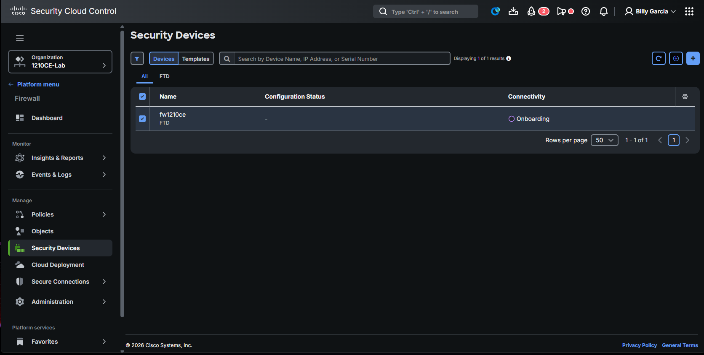
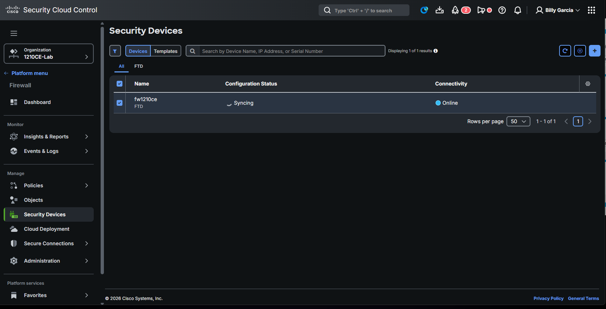
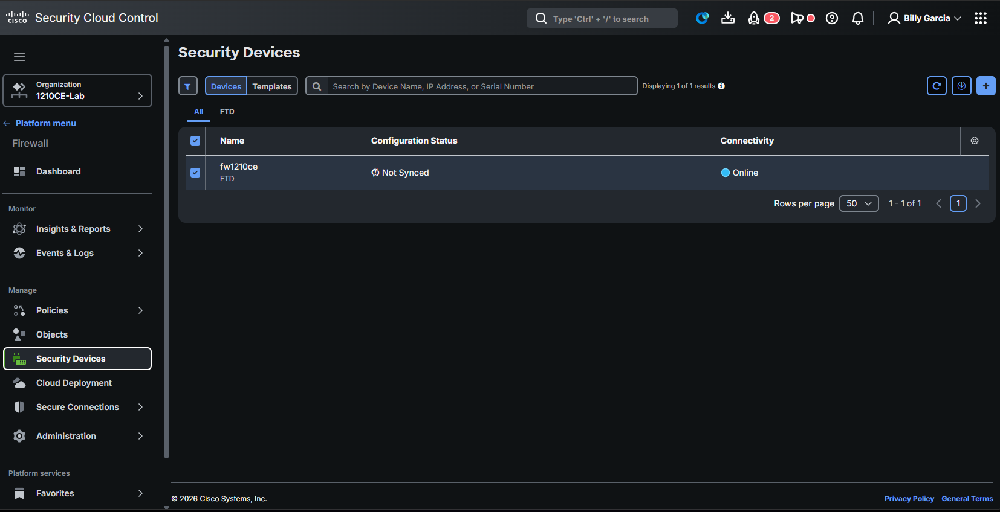
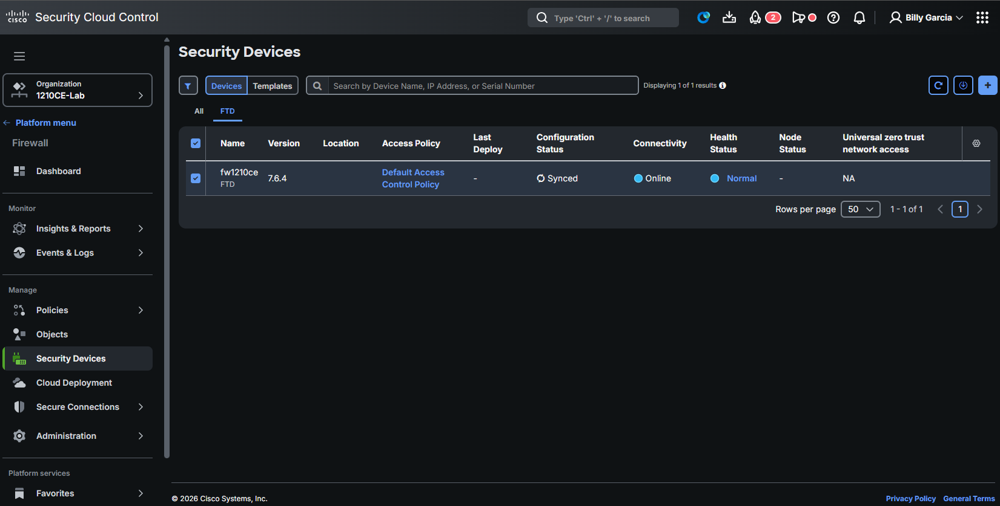

# Onboarding to Security Cloud Control — cdFMC path

!!! success "✅ Live-captured 2026-07-11 · sftunnel established in ~4 min · Steps 4-5 pending SCC-side verification"
    Full CLI Registration Key flow captured empirically against `fw1210ce` at 192.168.40.10 onto a fresh SCC Base tenant (`1210CE-Lab`, region us-west-2). Steps 0-3 complete with observed timings + verbatim FTD/SCC output; Steps 4-5 (SCC-side Online + round-trip deploy) queued for the current session's final capture pass.

**Prerequisites:**

- [Ch 4](first-boot.md) verified — FDM reachable at `https://<mgmt-ip>/`
- [Ch 6](fdm-baseline.md) baseline complete — hostname, DNS, static mgmt IP set
- Cisco.com account with SCC entitlement (see Step 0 below)
- Outbound HTTPS from mgmt to `*.cdo.cisco.com` and `*.security.cisco.com` — verify with `curl -sI https://edge.us.cdo.cisco.com/` from a host on the same segment (a `403` or `200` HTTP response = reachable; connection refused / timeout = firewall problem)

Bring the 1210CE under **Cisco Security Cloud Control (SCC)** management via the **Cloud-delivered Firewall Management Center (cdFMC)** path. SCC is the unified cloud pane-of-glass for Cisco's security portfolio; cdFMC is SCC's FTD management surface.

## Tier prerequisite — this chapter's biggest gotcha

**Verified 2026-07-11 on a fresh SCC tenant with Firewall Management _Base_ subscription:**

- The modern SCC "Add Device → Firewall Threat Defense" flow surfaces **cdFMC-only** onboarding
- FDM-hybrid mode (Layer 2 in [Ch 5's deployment matrix](choose-mgmt-path.md)) is **NOT offered at Base tier**
- FDM-hybrid requires **Firewall Management _Premier_ tier** OR the legacy pre-Security-Cloud-Control CDO console

Decision tree for what to do based on your customer's tenant entitlement:

| Customer tenant tier | Available onboarding paths | Chapter that applies |
|---|---|---|
| **Firewall Management Base** | cdFMC only | This chapter (Ch 9) |
| **Firewall Management Premier** | cdFMC + FDM-hybrid | This chapter for cdFMC; a Premier-tier-hybrid variant is a future edit |
| **Legacy CDO console** (pre-SCC unification, still exists on some accounts) | FDM-hybrid (traditional CDO onboard) | A legacy-CDO variant is a future edit |
| **No tenant / no entitlement** | Register account at `sign-on.security.cisco.com`, then Base tier is free with 25-device cap for lab use | Start here — Step 0 below |

## Onboarding-mode consequences you have to accept before proceeding

The cdFMC onboarding path is destructive to FDM-authored policy. Cisco's own SCC UI warns:

> *"the firewall device manager will no longer manage the device, and all existing policy configurations on the device will be lost except for the basic interface configurations. Therefore, you must configure the policies from the corresponding manager."*

Concrete impact:

| Config category | Survives cdFMC onboard? |
|---|---|
| Interface / management IP / hostname (Ch 6) | ✅ ("basic interface configurations") |
| DNS / NTP / static routes (Ch 6) | ✅ (basic) |
| Access rules / IPS / URL filter (Ch 7) | ❌ — re-authored in cdFMC |
| Content DBs (VDB / SRU / Geo from Ch 8) | ✅ (on-device, not in FDM policy) |
| Smart License registration state | ✅ (kept) |

**If your FDM already has a policy set you can't afford to lose**, back it up first — [Ch 6 Backup and restore](fdm-baseline.md#backup) or via `POST /action/configexport` — before firing this chapter.

## Step 0 — Verify SCC tenant + Firewall Management entitlement

### 0a. Sign in to Security Cloud Sign-On

Browser to `https://sign-on.security.cisco.com` and log in with the Cisco.com account that owns the tenant.

**Verify:** the landing page shows a **"Security Cloud Control"** tile under **Your applications**. If not, your account has no SCC entitlement — provision it (or a free trial) before continuing.

### 0b. Enter or create the target organization

Click **Launch** on the Security Cloud Control tile. SSO redirect prompts to pick an organization (if you have several) or offers **Create new organization**.

**For lab or first-time customer onboards**, create a dedicated organization named for the box or engagement (e.g. `fw1210ce-lab`, `customer-name-poc`). Reasons:

- Devices land in a clean inventory instead of mixing into demo-org context
- Post-engagement cleanup is a single tenant delete instead of hunting for specific devices
- Regional edge endpoint is decided at org creation — pin to the customer's actual region

### 0c. Claim / enable Firewall Management

The new organization defaults to no active subscriptions. Path: **Administration → Subscriptions**.

Look for an in-banner "**Your organization is entitled to use Firewall Management. Enable Firewall Management now.**" notification. Click **Enable**. Cisco auto-detects the account-level entitlement and provisions the tenant-level Firewall Management binding — takes ~5 seconds. Result screen shows:

```
Product:   Cisco Security Cloud Control Firewall Management Base
Region:    North America     (or your tenant's region)
Quantity:  1 instance
Status:    Active
```

Record the **subscription ID** (long UUID). It's useful for audit / support tickets against the tenant.

**Do NOT enable Multicloud Defense** even though its notification appears — that's a separate product for cloud-native workloads (formerly Valtix), unrelated to the 1210CE hardware FTD.

## Step 1 — Enable cdFMC in the tenant

Navigate to **Firewall** section of the SCC left nav → **Security Devices**. First-time state:

```
Displaying 0 of 0 results
No devices or services found. You must onboard a device or service to get started.
```

Click the **`+`** button (top-right corner of the devices table). SCC opens the **Onboard FTD Device** wizard.

The wizard's first panel is exclusively titled **"Enable cdFMC"** for Base-tier tenants — click it. cdFMC provisioning begins.

Cisco's own UI (the info-tooltip on the `Provisioning` status) states:

> *"This process will take 15 to 30 minutes to complete."*

- **Behavior during provisioning:** you can navigate away; cdFMC access unlocks when ready
- **Where to see progress:** SCC → **Integrations → FMC** tab shows the new entry with `Status: Provisioning` · `Version: N/A` · `Devices: 0`
- **Signal it's done:** the Status column flips from `Provisioning` to the ready state; a notification bell + email typically follow

!!! info "Provisioning happens on Cisco's cloud infrastructure"
    You're not blocking on your box during this — the FTD isn't touched at all until Step 3. The 15-30 min wait is Cisco spinning up your dedicated cdFMC instance in the cloud region you selected in Step 0.

## Step 2 — Onboard-FTD-Device wizard (SCC → Security Devices → +)

The `+` opens the **Onboard FTD Device** wizard. Top strip offers three methods:

| Tile | Use case | Notes |
|---|---|---|
| **Use CLI Registration Key** | Recommended for any FTD you already have console/SSH to. FTD 7.0.3+ or 7.2+ | This chapter's flow |
| **Use Serial Number** | Zero-touch — factory-shipped 7.2+ device that has never been powered on | Skip if you've done Ch 6 baseline |
| **Bulk Onboard using CSV File** | Fleet onboards from a CSV | FTD 7.4+ only |

**Select CLI Registration Key.** The wizard walks through five numbered steps:

### 2a. Device Name

Enter a name matching the FTD hostname you set in [Ch 6](fdm-baseline.md) — e.g. `fw1210ce`. This name is the label in cdFMC's inventory; it doesn't have to match the FTD's system hostname (though it makes life simpler if it does).

### 2b. Policy Assignment

For a fresh install with no prior policy in the cdFMC instance, the only option is:

```
Access Control Policy: Default Access Control Policy
```

`Default Access Control Policy` is a Cisco-authored empty policy shell — no rules, default action `Block all traffic`. You'll re-author real rules in [Ch 10](scc-managed.md).

### 2c. Subscription Licenses

Check the license entitlements you want cdFMC to assert against the FTD's Smart License registration:

- **Threat** — IPS/Snort (required to author `Intrusion Policy` rules)
- **Malware Defense** — file/malware inspection
- **URL License** — URL category filtering

Base tier includes these in the entitlement (the SCC subscription itself provisions cdFMC + throws in the three feature licenses for the box). Skip any you know you won't use — but on a lab box, check all three.

### 2d. CLI Registration Key — the load-bearing step

SCC displays a copy-paste command in the format:

```
configure manager add <cdfmc-hostname> <reg-key> <nat-id> <display-name>
```

Sample from the live capture (yours will differ — the key and NAT ID are per-registration):

```
configure manager add 1210ce-lab--ti0cqk.app.us.cdo.cisco.com \
    VuSxkHYOFGdhNTSbBCrH0TMGmo4RHGcw \
    tQwkA2WY4G0baoY3ofJEXAJN0qftpnu1 \
    1210ce-lab--ti0cqk.app.us.cdo.cisco.com
```

Breakdown of the four positional args (per Cisco `configure manager add` syntax):

| Position | Value in our capture | Meaning |
|---|---|---|
| 1 | `1210ce-lab--ti0cqk.app.us.cdo.cisco.com` | cdFMC endpoint — where the FTD initiates sftunnel |
| 2 | `VuSxkHYOFGdhNTSbBCrH0TMGmo4RHGcw` | Registration key — one-shot, ~1h TTL, single-use |
| 3 | `tQwkA2WY4G0baoY3ofJEXAJN0qftpnu1` | NAT ID — pairs FTD side of sftunnel through NAT (our FTD mgmt is behind UDM Pro) |
| 4 | `1210ce-lab--ti0cqk.app.us.cdo.cisco.com` | Display name in cdFMC inventory (SCC defaults it to the cdFMC hostname) |

Wizard advice text:

> *"Ensure device's initial configuration is complete before trying to apply the registration key. Copy the CLI Key below and paste it into the CLI of the FTD."*

The wizard has two states here — the command panel with a **Copy** button, and after you paste it on the FTD and click **Next**, the step flips to `Done`.

### 2e. Fire the command on the FTD

SSH (or console) to the FTD as `admin` and drop to the `>` prompt (**not** the diag CLI). Paste the whole command line as one string. FTD responds:

```
If you enabled any feature licenses, you must disable them in Secure Firewall Device Manager
before deleting the local manager.
Otherwise, those licenses remain assigned to the device in Cisco Smart Software Manager.
Do you want to continue[yes/no]:
```

This warning is standard Cisco boilerplate about Smart License reallocation. On our lab box in eval-license state (see [Ch 8's strong-crypto discussion](content-updates.md#strong-crypto)) there's nothing to reallocate — answer `yes`.

Immediate FTD response:

```
Local Manager successfully deleted.
DHCP server is already disabled
DHCP Server Disabled
No managers configured.
Automatically deleted local manager during manager add and enabled off-box management.
Manager 1210ce-lab--ti0cqk.app.us.cdo.cisco.com successfully configured.
Please make note of reg_key as this will be required while adding Device in FMC.
```

**Two things just happened irreversibly:**

1. **Local Manager (FDM standalone) deleted** — FDM UI is now decommissioned as the policy authority. You can still reach it, but it's read-only or errors on writes.
2. **DHCP server disabled** — FDM's built-in DHCP scope on the `mgmt` interface is torn down. If anything on that mgmt segment was leasing IPs from FDM (unlikely in a data-center lab, common in SMB), it just lost DHCP.

**Nothing yet is proven working** — the manager entry is configured but sftunnel hasn't established. That's Step 3.

### 2f. Back in the SCC wizard — click Next through Step 5

- Step 4 flips to **Done** with a green check
- Step 5 opens with: *"Your device is now onboarding. This may take a long time to finish. You can check the status of the device on the Devices and Services page."*
- Optional: add labels (skip for a single-box lab)
- Click **Go to Security Devices**

Wizard is closed. The rest happens in the background.

## Step 3 — Verify sftunnel is establishing

### 3a. FTD side — poll `show managers`

Reconnect over SSH and poll:

```
> show managers
Type          : Manager
Host          : 1210ce-lab--ti0cqk.app.us.cdo.cisco.com
Display name  : 1210ce-lab--ti0cqk.app.us.cdo.cisco.com
Identifier    : 632bce0c-ca99-4003-868a-d47bbeb535c7
Registration  : In progress
```

**`Registration` field state machine:**

| Value | Meaning |
|---|---|
| `In progress` | Handshake underway — cert exchange, sftunnel negotiating |
| `Completed` (or `Enabled`) | sftunnel is up bidirectionally |
| `Failed` | Handshake broken — check DNS / firewall / key expiration |

Poll every ~60s. Cisco docs cite up to 15 min for the full handshake to complete; on the reference lab the FTD went from `configure manager add` at 08:57 EDT to `Registration : Completed` at 09:01 EDT — **~4 minutes**. Healthy management-network paths should land in the 3-10 min range; anything past 15 min means something is wrong (see Common gotchas below).

!!! danger "Timed-out first attempts are retryable — no need to regenerate the SCC key"
    **Empirically observed on the reference lab 2026-07-11:** the first `configure manager add` attempt got interrupted (SSH session died before `yes` was answered). cdFMC's Task Manager logged the failure verbatim:

    ```
    Register  fw1210ce: Registration timed out. Please check connectivity and registration id
              Started: 08:55:25 EDT  Finished: 08:57:31 EDT  Status: FAILURE
    ```

    A second `configure manager add` fired ~30 seconds later with the same registration key and NAT ID went through cleanly:

    ```
    Register  fw1210ce: Started device discovery
              Started: 08:58:03 EDT  Finished: 09:01:20 EDT  Status: SUCCESS
    ```

    **The SCC-side registration key was NOT invalidated by the timeout.** Same key + same NAT ID + fresh `configure manager add` = successful retry. If you hit "Registration timed out" once, don't panic and don't regenerate the key from SCC — just re-fire the CLI command. Cisco's registration key TTL is generous (documented at ~2 hours from generation, though not verified in Cisco docs against the current 2026 UI).

**Post-handshake `show managers` looks like:**

```
Type              : Manager
Host              : 1210ce-lab--ti0cqk.app.us.cdo.cisco.com
Display name      : 1210ce-lab--ti0cqk.app.us.cdo.cisco.com
Identifier        : 632bce0c-ca99-4003-868a-d47bbeb535c7
Registration      : Completed
Management type   : Configuration
```

**`Management type: Configuration`** is the important line — cdFMC has full policy authority. Any other value (`Manager`, `Event`, etc.) means the sftunnel is up but the FTD isn't fully cdFMC-managed and something needs troubleshooting.

### 3b. cdFMC side — SCC Security Devices inventory

While the FTD is negotiating, refresh **SCC → Security Devices**. The row for `fw1210ce` walks a three-state visible progression:

| Phase | Connectivity | Configuration Status (All tab) | Observed timing (reference lab) |
|---|---|---|---|
| Handshake underway | 🟡 **Onboarding** | `—` (dash) | 0-3 min after `configure manager add` |
| Sftunnel up, initial pull | 🟢 **Online** | 🔄 **Syncing** (spinner) | 3-7 min |
| Onboarded, awaiting first deploy | 🟢 **Online** | ⚠ **Not Synced** | ~10 min |

**Screenshot evidence (reference lab, 2026-07-11):**


*T+3 min — `Onboarding` connectivity, no configuration status yet*


*T+7 min — `Online` connectivity, `Syncing` configuration status*


*T+~10 min — `Online` connectivity, `Not Synced` configuration status on the **All** tab.*

### 3b-1. The All tab and the FTD tab disagree — and why

**Documented empirically on our reference lab, 2026-07-11:** the Security Devices page has two tabs — **All** and **FTD** — and they surface **different Configuration Status values for the same device** during the onboarding window. Click the **FTD** tab to get the truthful FTD-specific readout:


*Same device, FTD tab: `Configuration Status: Synced`, plus 6 extra columns not shown on the All tab*

Comparison of the two tabs on the exact same device at the exact same instant:

| Column | All tab | FTD tab |
|---|---|---|
| Configuration Status | ⚠ **Not Synced** | ✅ **Synced** |
| Connectivity | 🟢 Online | 🟢 Online |
| Access Policy | *(not shown)* | Default Access Control Policy (link) |
| Last Deploy | *(not shown)* | `—` (never deployed) |
| Health Status | *(not shown)* | 🟢 Normal |
| Node Status | *(not shown)* | `—` |
| Version | *(not shown)* | 7.6.4 |
| Universal ZTNA | *(not shown)* | NA |

**Which one to trust:** the **FTD tab is authoritative**. The All tab's `Not Synced` badge appears to reflect an aggregate/legacy view; the FTD tab's `Synced` is the correct sftunnel-baseline sync state.

**What the FTD tab actually tells you:**

- `Configuration Status: Synced` — sftunnel handshake completed and device baseline matches cdFMC's record — this is the healthy steady state
- `Last Deploy: —` — no policy has ever been deployed to the device from cdFMC. The Default ACP is *assigned* to `fw1210ce` (the clickable "Default Access Control Policy" link proves that) but it has not been *pushed* yet
- `Health Status: Normal` — device health monitoring reports OK
- `Access Policy: Default Access Control Policy` (clickable) — you can navigate straight into policy editing from here

Step 5 will fire the first deploy and flip `Last Deploy` from `—` to a timestamp.

!!! info "Root cause of the discrepancy — documented, not a bug"
    Initially, this looked like a UX bug worth reporting to TAC. **It is not.** Cisco documents that after a cdFMC-side deploy finishes, `configState` on SCC can take **up to 10 minutes** to update — see [cdFMC-Managed FTDs Only — Deploy FTD Device Changes](https://developer.cisco.com/docs/cisco-security-cloud-control-firewall-manager/cdfmc-managed-ftds-only-deploy-ftd-device-changes/). What we observed in the two-tab discrepancy is that lag:

    - **FTD tab** was reading current cdFMC state directly → `Synced`
    - **All tab** was reading its own cached aggregate state that hadn't yet caught up → `Not Synced`

    The retroactive proof came from cdFMC's Deployments notification pane ([Ch 10 → "First look — Device Summary"](scc-managed.md)), which showed the initial policy deploy had already completed by the time we opened cdFMC. See Ch 10 for the full sequence.

    **Practical rule for the guide:** if the two tabs disagree during onboarding, trust the FTD tab. If they still disagree after ~10 min, then it's worth investigating.

    **Empirical follow-up (2026-07-11):** on the reference lab we captured the SCC All tab still showing `Not Synced` at 09:12 EDT — ~11 min after onboard. Then at 09:29 EDT (~28 min after onboard), the All tab had caught up to `Synced`. See [Ch 10 → "Getting into cdFMC"](scc-managed.md) for the follow-up screenshot with the resolved state.

### 3c. FDM side — verify FDM is now read-only

Optional but instructive — browse to `https://192.168.40.10/` and confirm FDM shows a **"Managed by cdFMC"** banner or similar warning. Any policy write from FDM UI now errors.

## Step 4 — Verify sftunnel healthy

Once `Registration : Completed` shows on the FTD and cdFMC shows the device Online:

- `show managers` shows `Registration : Completed`
- cdFMC device list has the FTD's serial (visible on hover)
- cdFMC's Device Management panel shows the interface list matching what Ch 6 configured

## Step 5 — Initial deploy: flip `Last Deploy: —` to a timestamp

The FTD tab shows `Configuration Status: Synced` but `Last Deploy: —` — the sftunnel baseline is in sync, but no policy has ever been pushed. This step fires the first deploy from cdFMC, which doubles as the round-trip test: an unedited Default ACP push from cdFMC to `fw1210ce` proves the management pipe works.

### 5a. Path into cdFMC's Device Management panel

Two ways in:

1. **From SCC**: Left nav → **Integrations → FMC** → click your cdFMC instance → **Devices → Device Management** (cdFMC opens in a new tab, single-sign-on from SCC session)
2. **From SCC directly**: The `fw1210ce` row in Security Devices has a link that jumps to the cdFMC device page

### 5b. Fire the initial deploy

In cdFMC → **Deploy → Deployment**:

1. `fw1210ce` shows in the deployable-devices list with an `Access Control Policy` (or similar) pending change
2. Select the checkbox next to `fw1210ce`
3. Click **Deploy**
4. Wait for the deployment task to complete (5-30 min for initial deploy — this is the first full policy push, plus platform settings, plus interface config reconciliation)

### 5c. Verify success

**In cdFMC:**

- The deployment task shows `Deployment Successful` (green check)
- Security Devices row now shows `Configuration Status: Synced` (or the `Not Synced` warning icon disappears)

**On the FTD (SSH `admin@192.168.40.10`):**

```
> show access-control-config
```

Should return the Default ACP's rule set (empty except for the `Block all traffic` default action). Before the deploy, it returned an empty ruleset from the Local Manager wipe.

### 5d. If deploy fails with a strong-encryption error

Expected on our reference lab — the [Ch 7 strong-crypto trap](fdm-baseline.md#strong-crypto) surfaces on the cdFMC-managed side too. Same root cause: eval Smart License with `exportControl:null` blocks strong-crypto policy commit, and the check runs on the FTD regardless of which management surface sent the deploy.

Empirical outcome to record when you run it:

- Does the deploy fail *at cdFMC's job level* (deploy job never starts), or does the deploy job succeed at cdFMC and then fail *on-device* (FTD rejects the policy commit at the sftunnel-transferred config-apply step)?
- What's the exact error string in cdFMC's deployment history?

See [Ch 14 — Smart Licensing](smart-licensing.md) (queued) for the clean fix; for the interim, either author only non-encryption-sensitive policy or register the FTD with a real Smart Account.

## Common onboarding gotchas — reference

- **Token expires** — SCC-side tokens have a ~1 hour countdown. If the FDM enroll doesn't fire in that window, regenerate. Ch 9's flow queues the FDM POST first so we're pasting-and-firing back-to-back.
- **FW can't reach `edge.<region>.cdo.cisco.com`** — check that mgmt has outbound HTTPS. Talos content updates from Ch 8 working = outbound path healthy.
- **Smart License in bad state** — SCC accepts EVAL entitlement for onboard. If Smart Licensing shows `Not Compliant`, sort that first before onboard — cdFMC won't let you deploy policy against a non-compliant license.
- **NAT / IP mismatch** — if the FTD is behind NAT (like our lab where mgmt has ISP behind UDM Pro), the NAT ID field on the SCC token matters. Cisco docs at [DevNet](https://developer.cisco.com/docs/cdo/) have the specifics.

## Next

Once the sftunnel is up and Step 5 round-trip passes, head to [Ch 10 — Managing via cdFMC](scc-managed.md) for the day-to-day workflow.
